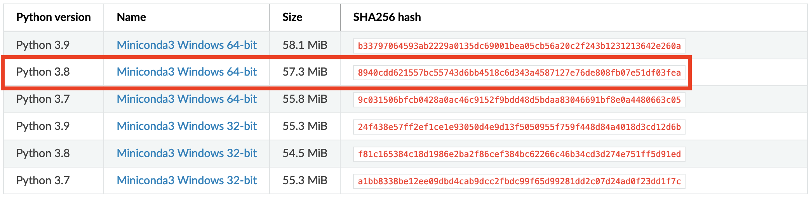
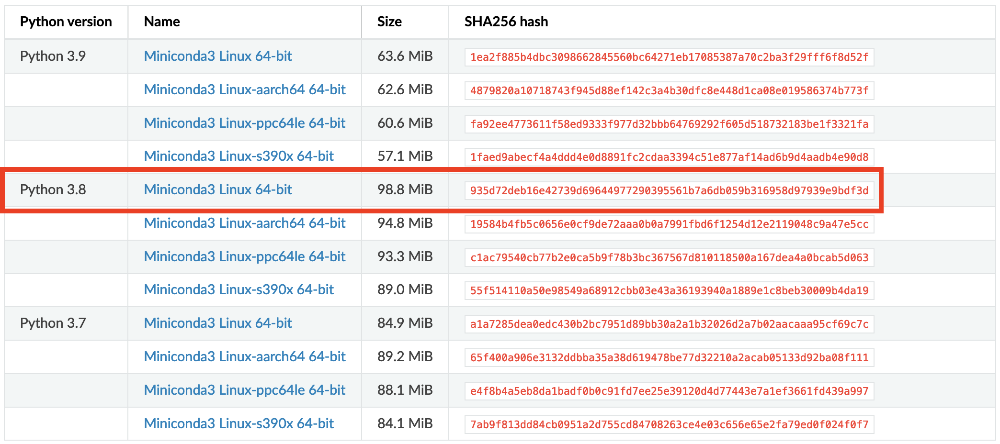

Installing Python
=================

**It is possible to do programming with Python on your own computer**, but first you need to install Python. The purpose of this page is to help you to
install Python and different Python packages into your own computer. Even though it is possible to install Python from their `homepage <https://www.python.org/>`_,
**we highly recommend using** `Miniconda <https://docs.conda.io/en/latest/miniconda.html>`_ for installing Python.
Miniconda comes with Python and a small number of useful packages. Additional packages can be installed using the package management system `conda <https://docs.conda.io/en/latest/>`__.

Miniconda is a mini version of `Anaconda <https://www.anaconda.com/>`_ which is an open source distribution of the Python and R programming
languages for large-scale data processing, predictive analytics, and scientific computing, that aims to simplify package management and deployment. In short,
it makes life much easier when installing new tools to your Python. Full anaconda installation comes with all packages needed in the Geo-Python course (and many more!),
but Miniconda allows us to save some disk space and avoid conflicts among packages (important for those installing GIS-packages!).

In case you already have Anaconda installed on your computer, you can continue using that during the Geo-Python course without a problem.
**If you are new to Python and have not yet installed anything, we recommend you to start by** `installing Miniconda on your computer <https://docs.conda.io/en/latest/miniconda.html>`__.


Install Miniconda on Windows
-------------------------

Visit the `Miniconda download page <https://docs.conda.io/en/latest/miniconda.html#windows-installers>`__ and download the latest
**Miniconda3 Windows 64-bit** installer for Windows.



Install Miniconda to your computer by double clicking the installer and install it into a directory you want (needs admin rights).
Install it to **all users** and use default settings.

.. note::

    Windows users with a **computer administered by the University of Helsinki**: If you don't have administrator rights on your
    computer, you might want to apply for an admin account.
    Read more about administrator rights and software installations in `here <https://helpdesk.it.helsinki.fi/en/instructions/computer-and-printing/workstation-administrator-rights>`__


Test that the package manager ``conda`` works by
`opening a command prompt as a admin user <http://www.howtogeek.com/194041/how-to-open-the-command-prompt-as-administrator-in-windows-8.1/>`_
and running command ``conda --version``. If the command returns a version number of conda (e.g. ``conda 4.5.9``) everything is working correctly.

Install Python on macOS
-----------------------
Visit the `Miniconda download page <https://docs.conda.io/en/latest/miniconda.html#macosx-installers>`__ and download the latest
Python 3.8 installer for macOSX.

.. figure:: img/miniconda-osx.png
    :width: 600px
    :align: center
    :alt: Downloading the latest Miniconda for Mac

Install Python on Linux
-----------------------
Visit the `Miniconda download page <https://docs.conda.io/en/latest/miniconda.html#linux-installers>`__ and download the latest
Python 3.8 installer for Linux.



The following have been tested on Ubuntu 16.04. Might work also on Mac (not tested yet).

**Install Anaconda 3 and add it to system path**


.. code-block::

    # Download and install Anaconda
    sudo wget https://repo.continuum.io/archive/Anaconda3-4.1.1-Linux-x86_64.sh
    sudo bash Anaconda3-4.1.1-Linux-x86_64.sh

    # Add Anaconda installation permanently to PATH variable
    nano ~/.bashrc

    # Add following line at the end of the file and save (EDIT ACCORDING YOUR INSTALLATION PATH)
    export PATH=$PATH:/PATH_TO_ANACONDA/anaconda3/bin:/PATH_TO_ANACONDA/anaconda3/lib/python3.5/site-packages


Installing packages using Conda
---------------------------------

Conda has an excellent `online user guide <https://docs.conda.io/projects/conda/en/latest/index.html>`__ which covers most of the basic things, such as installing new packages.

The easiest way
~~~~~~~~~~~~~~~

You can install new packages using the ``conda install`` command in a terminal of an Anaconda Prompt (as admin).

::

    conda install [packagename]

You can first check which packages you have installed using the ``conda list`` command.
It's a good idea to search for installation instructions for each package online.


Installing Jupyter Lab using conda
~~~~~~~~~~~~~~~~~~~~~~~~~~~~~~~~~~

If you want to use Jupyter Lab on your own computer, you can install it using conda (or pip).
First, have a quick look at the Jupyter Lab installation instructions: https://jupyterlab.readthedocs.io/en/stable/getting_started/installation.html

According to the instructions, you can run:

```
conda install -c conda-forge jupyterlab
```

After installation is completed, you can start a Jupyter Lab instance by running this command:


.. code-block::

    jupyter lab

Jupyter Lab should open up in a browser window.


Alternative way to install packages if typical doesn't work
~~~~~~~~~~~~~~~~~~~~~~~~~~~~~~~~~~~~~~~~~~~~~~~~~~~~~~~~~~~

In most cases using ``conda install`` is the best approach, but sometimes you get errors when trying to install a package.
Here is an example when trying to install a module called shapely:


.. code-block::

    C:\WINDOWS\system32>conda install shapely
    Using Anaconda API: https://api.anaconda.org
    Fetching package metadata .........
    Solving package specifications: .
    Error: Package missing in current win-64 channels:
      - shapely

    You can search for packages on anaconda.org with

        anaconda search -t conda shapely

In this case conda was not able to find the shapely module from the default channel it uses for downloading the module.
Conda downloads packages from different remote `channels <https://docs.conda.io/projects/conda/en/latest/user-guide/concepts/channels.html>`__, and it is often good
idea to download all packages from the same channel in order to avoid conflicts with versions.


If ``conda install`` command was not able to install the package you were interested in there is an alternative way to do it by taking advantage of different conda distribution channels that
are maintained by programmers themselves. An easy way to find the right command to install a package from these alternative conda distribution channels is to Google it.

Let's find our way to install the Shapely module by typing following query to Google:

.. image:: img/google_query_conda.PNG

Here, we can see that we have different pages showing how to install ``Shapely`` using conda package manager.

**Which one of them is the correct one to use?**

We need to check the operating system banners and if you find a logo of the operating system of your computer,
that is the one to use! Thus, in our case the first page that Google gives does not work in Windows but the second one does, as it has Windows logo on it:

.. image:: img/conda_shapely_windows.PNG

From here we can get the correct installation command for conda and it works!

.. image:: img/install_shapely.PNG

You can follow these steps similarly for all of the other Python modules that you are interested to install.


