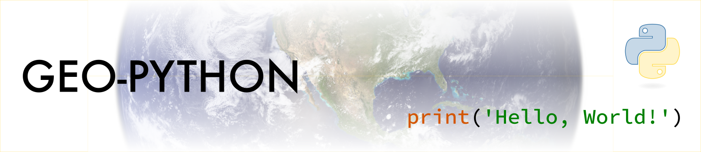

.. Geo-Python documentation master file, created by
   sphinx-quickstart on Thu Aug 23 14:00:02 2018.
   You can adapt this file completely to your liking, but it should at least
   contain the root `toctree` directive.

Welcome to Geo-Python 2020!
===========================

The **Geo-Python** course teaches you the basic concepts of programming and scientific data analysis using the Python programming language
in a format that is easy to learn and understand (no previous programming experience required).
Each lesson is a tutorial with specific topic(s) where the aim is to gain skills and understanding
how to solve common data-related tasks using Python.
Geo-Python is organized by the `Department of Geosciences and Geography <https://www.helsinki.fi/en/faculty-of-science/faculty/geosciences-and-geography>`__
at the University of Helsinki.

Geo-Python covers the necessary skills needed before continuing to the more advanced courses
`Automating GIS processes <https://autogis.github.io>`_ and/or
`Introduction to Quantitative Geology <https://introqg.github.io>`_.

.. admonition:: Open Access!

    The course is **open for everyone to follow online**. The aim of this course is to share the knowledge and help people to get started with their journey for doing science more efficiently and in a reproducible manner
    using Python programming.

.. admonition:: University of Helsinki students

    The Geo-Python course runs under two course codes in teaching period 1 at the University of Helsinki.
    Please sign up using only one of these course codes (not both)!

    - GEOG-329-1 for geography students
    - GEOK_3030 for geology students

Course format
-------------

The majority of this course will be spent in front of a computer learning to program in the Python language.
The course consists of interactive lectures and weekly exercises. The exercises will focus on developing
basic programming skills using Python and applying those skills to various analytical problems.
Typical exercises will involve a brief introduction followed by topical computer-based tasks.
For each exercise, you may be asked to submit the Python codes you have written, output figures and answers
to related questions. You are encouraged to discuss and work together with other students while working
on the weekly exercises. However, the exercises you submit must be completed individually and
must clearly reflect your own work (in short, don't copy paste from other students).

.. admonition:: Online teaching

    Please note that the course is organized completely online during the 2020 Autumn semester.
    Online support will be available throughout the course during the weekly exercise sessions and discussion channels in Slack.
    Details of participation in the exercise sessions will be sent out to enrolled students.

Course topics
-------------
After completing this course, the students understand basic programming concepts,
are able to write short programs, and can manage, analyze and visualize scientific data using Python.
The students also learn to use version control (git) and online repositories (GitHub) for documenting and communicating their work.
Themes for each week are listed below. Read more about the weekly :doc:`learning goals in here <course-info/learning-goals>`.

The course runs for seven weeks in the Autumn semester starting on the 2nd of September 2020.
New materials are updated on this course page each Wednesday.

+----------+----------------------+
| Week     | Theme                |
+==========+======================+
|**1**     | Basic concepts of    |
|          | Python and computer  |
|          | programs             |
|          |                      |
+----------+----------------------+
|**2**     | Diving into Python   |
|          |                      |
|          |                      |
+----------+----------------------+
|**3**     | Repeating tasks      |
|          | and making decisions |
|          |                      |
|          |                      |
+----------+----------------------+
|**4**     | Creating and using   |
|          | functions            |
|          |                      |
+----------+----------------------+
|**5**     | Data analysis        |
|          | Part I               |
|          |                      |
+----------+----------------------+
|**6**     | Data analysis        |
|          | Part II +            |
|          | Dealing with errors  |
+----------+----------------------+
|**7**     | Data visualization   |
|          |                      |
|          |                      |
+----------+----------------------+

.. admonition:: Step by step instructions with cloud computing!

    The materials are written in a way that you can follow them step by step exactly as they are written, as long as you use the cloud computing resources that
    we provide for you (namely JupyterLab Notebooks using Binder or CSC Cloud computing resources). Read more about our cloud computing environment from :doc:`here <lessons/L1/course-environment-components>`.
    If you work from your own computer, **you need to adjust the file paths to the data** accordingly.

.. admonition:: For teachers

    If you would like to use these materials for your own teaching or develop them further, we highly support that.
    Please read more about how to do it from :doc:`our licensing terms<course-info/licensing>`.

.. toctree::
    :maxdepth: 2
    :caption: Course information

    course-info/course-info
    course-info/learning-goals
    course-info/grading
    course-info/licensing

.. toctree::
    :maxdepth: 2
    :caption: Lesson 1

    lessons/L1/motivation
    lessons/L1/overview
    lessons/L1/course-environment-components
    lessons/L1/slack-usage
    notebooks/L1/a-taste-of-python.ipynb
    notebooks/L1/gcp-1-variable-naming.ipynb
    lessons/L1/exercise-1

.. toctree::
    :maxdepth: 2
    :caption: Lesson 2

    lessons/L2/overview
    notebooks/L2/Python-basic-elements.ipynb
    lessons/L2/intro-to-GitHub
    lessons/L2/git-basics
    lessons/L2/GitHub-classroom
    notebooks/L2/gcp-2-describing-code.ipynb
    lessons/L2/why-pairs
    lessons/L2/exercise-2

.. toctree::
    :maxdepth: 2
    :caption: Lesson 3

    lessons/L3/overview
    notebooks/L3/for-loops.ipynb
    notebooks/L3/conditional-statements.ipynb
    notebooks/L3/gcp-3-pep8.ipynb
    lessons/L3/exercise-3

.. toctree::
    :maxdepth: 2
    :caption: Lesson 4

    lessons/L4/overview
    notebooks/L4/functions.ipynb
    notebooks/L4/modules.ipynb
    notebooks/L4/gcp-4-writing-scripts.ipynb
    lessons/L4/exercise-4

.. toctree::
    :maxdepth: 2
    :caption: Lesson 5

    lessons/L5/overview
    lessons/L5/pandas-overview.rst
    notebooks/L5/exploring-data-using-pandas.ipynb
    notebooks/L5/processing-data-with-pandas.ipynb
    lessons/L5/exercise-5

.. toctree::
    :maxdepth: 2
    :caption: Lesson 6

    lessons/L6/overview
    notebooks/L6/advanced-data-processing-with-pandas.ipynb
    notebooks/L6/errors.ipynb
    notebooks/L6/gcp-5-assertions.ipynb
    notebooks/L6/debugging.ipynb
    lessons/L6/exercise-6

.. toctree::
    :maxdepth: 2
    :caption: Lesson 7

    lessons/L7/overview
    lessons/L7/python-plotting
    lessons/L7/plot-anatomy
    notebooks/L7/matplotlib.ipynb
    notebooks/L7/advanced-plotting.ipynb
    lessons/L7/exercise-7

.. toctree::
    :maxdepth: 2
    :caption: Final exercise

    final-exercise/overview
    final-exercise/grading.ipynb

.. toctree::
    :maxdepth: 2
    :caption: Resources

    course-info/python-vocabulary
    course-info/installing-miniconda
    course-info/resources
