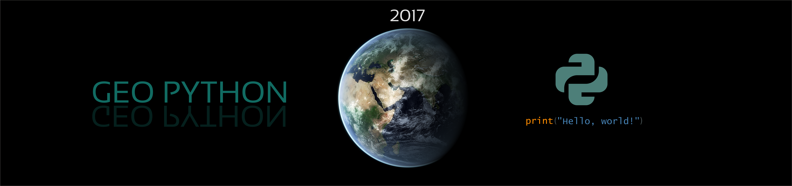

.. Geo-Python-2017 documentation master file, created by
   sphinx-quickstart on Mon Feb 20 15:58:24 2017.
   You can adapt this file completely to your liking, but it should at least
   contain the root `toctree` directive.

Welcome to Geo-Python 2017!
================================================

**Geo-Python** -course teaches you the basic concepts of programming using Python programming language that is easy to learn and understand (no previous programming experience required).
Each lesson is a tutorial with specific topic(s) where the aim is to gain skills and understanding how to solve common data-related tasks using Python programming (see schedule & learning goals).

In the lessons we use only publicly available data which can be used and downloaded by anyone anywhere.

Course format
-------------

The majority of this course will be spent in front of a computer learning to program in the Python language and working on exercises.
During Teaching Period I, the `Automating GIS processes <https://autogis.github.io>`_ and `Introduction to Quantitative Geology <https://github.com/Intro-Quantitative-Geology/Course-information>`_
courses will meet together and focus on learning the basic concepts of programming using Python programming language.

The computer exercises will focus on developing basic programming skills using the Python language and applying those skills to various problems.
Typical exercises will involve a brief introduction followed by topical computer-based tasks. At the end of the exercises, you may be asked to submit answers
to relevant questions, some related plots, and/or Python codes you have written or used. You are encouraged to discuss and work together with other students
on the laboratory exercises, however the laboratory summary write-ups that you submit must be completed individually and must clearly reflect your own work.

Schedule
--------

The materials are divided into weekly themes that are published at these pages every Wednesday morning. Lessons are held with following schedule.
See the **learning goals** for each lesson from `here <0-learning-goals.html>`__.

+----------------+---------------------------------+
| Time           | Theme                           |
+================+=================================+
| **Class 1**    | Basic concepts of Python and    |
|   6.9.2017     | computer programs               |
|                |                                 |
|                |                                 |
+----------------+---------------------------------+
| **Class 2**    | Diving into Python              |
|  13.9.2017     |                                 |
|                |                                 |
|                |                                 |
+----------------+---------------------------------+
| **Class 3**    | Repeating tasks and making      |
|                | desicions                       |
|                |                                 |
|                |                                 |
+----------------+---------------------------------+
| **Class 4**    | Creating and using functions    |
|                |                                 |
|                |                                 |
+----------------+---------------------------------+
| **Class 5**    | Data analysis with Pandas       |
|                | Part I                          |
|                |                                 |
+----------------+---------------------------------+
| **Class 6**    | Data analysis with Pandas       |
|                | Part II + Dealing with errors   |
|                |                                 |
+----------------+---------------------------------+
| **Class 7**    | Basics of data visualization    |
|                |                                 |
|                |                                 |
+----------------+---------------------------------+

|

.. admonition:: Open Access!

    The course is **open for everyone**. The aim of this course is to share the knowledge and help people to get started with their journey for doing science more efficiently and in a reproducible manner
    using Python programming.

.. admonition:: Step by step instructions with cloud computing!

    The materials are written in a way that you can follow them step by step exactly as they are written, as long as you use the cloud computing resources that
    we provide for you (unfortunately **for Uni. Helsinki people** only). Read more about our cloud computing environment from `here <https://github.com/Python-for-geo-people/Lesson-1-Course-Environment/blob/master/Background/course-environment-components.md>`_.
    If you work from your own computer, **you need to adjust the file paths to the data** accordingly.

.. admonition:: For teachers

    If you would like to use these materials for your own teaching or develop them further, we highly support that.
    Please read more about how to do it from `here <License-terms.html>`_.

.. toctree::
    :maxdepth: 2
    :caption: Course information

    course-info
    0-learning-goals

