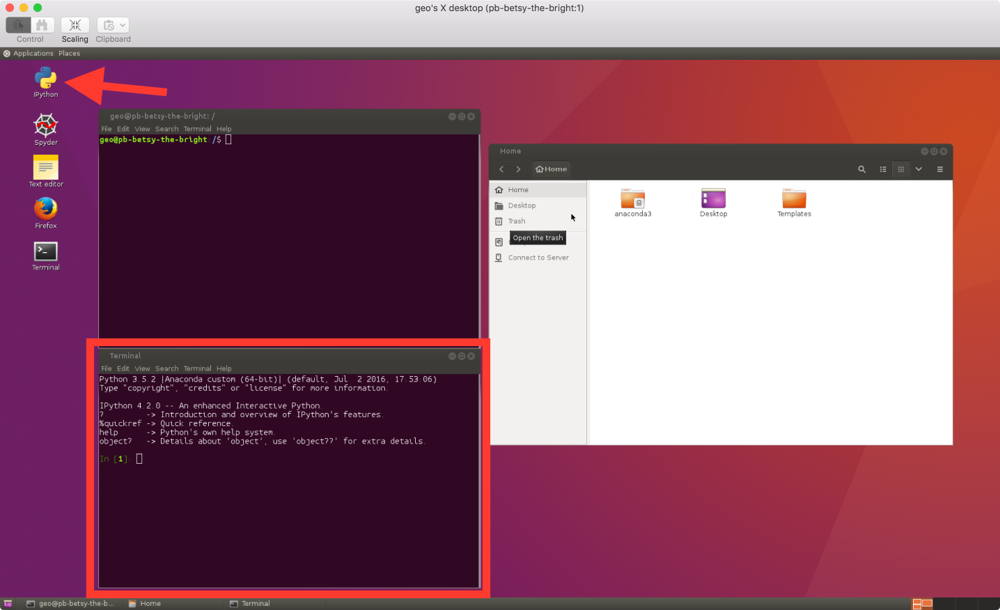

Sources
=======

This tutorial is based on a the `Software Carpentry
group's <http://software-carpentry.org/>`__ lessons on `Programming with
Python <http://swcarpentry.github.io/python-novice-inflammation/>`__.

Getting started
===============

We will start our Python lesson by opening a program called **Spyder**.
We'll learn more about how **Spyder** works later in the course, but for now we will be using some basic features of **Spyder** such as the IPython interpreter window.
In the IPython interpreter window you can type in Python commands and press **Enter** to execute them.

   IPython window

1. 

We can start by opening a new IPython window. To do this,
   double-click on the IPython icon on the Desktop. You should see a new
   terminal window appear that looks like the one below.

   IPython window

Now we are ready to start.

Variables, arithmetic and libraries
===================================

We will start our Python lesson by learning a bit of the basic
operations you can perform using Python.

1. Python can be used as a simple calculator.

    .. ipython::

        In [1]: 1 + 1

        In [1]: 5 * 7

2. You can use Python for more advanced math by using *functions*.
   Functions are pieces of code that perform a single action such as
   printing information to the screen (e.g., the ``print()`` function).
   Functions exist for a huge number of operations in Python.

    .. ipython:: python

        sin(3)
        sqrt(4)

   Wait, what? Python can't calculate square roots or do basic
   trigonometry? Of course it can, but we need one more step.

3. The list of basic arithmetic operations that can be done by default
   in Python is in the table below.

    +----------------+--------+----------------+----------------+
    | Operation      | Symbol | Example syntax | Returned value |
    +================+========+================+================+
    | Addition       | ``+``  | ``2 + 2``      | ``4``          |
    +----------------+--------+----------------+----------------+
    | Subtraction    | ``-``  | ``4 - 2``      | ``2``          |
    +----------------+--------+----------------+----------------+
    | Multiplication | ``*``  | ``2 * 3``      | ``6``          | 
    +----------------+--------+----------------+----------------+
    | Division       | ``/``  | ``4 / 2``      | ``2``          |
    +----------------+--------+----------------+----------------+
    | Exponentiation | ``**`` | ``2**3``       | ``8``          |
    +----------------+--------+----------------+----------------+
    For anything more advanced, we need to load a *module*.

    .. ipython::

        In [1]: import math

        In [1]: math.sin(3)

        In [1]: math.sqrt(4)

    A *module*, also known as a *library*, is a group of code items such as functions that are related to one another.
    Modules are loaded using ``import``.
    Functions that are part of the module ``modulename`` could then be used by typing ``modulename.functionname()``.
    For example, ``sin()`` is a function that is part of the ``math`` module, and used by typing ``math.sin()`` with some number between the parentheses.
    Modules may also contain constants such as ``math.pi``.

    .. ipython::

        In [1]: math.pi

        In [1]: math.sin(math.pi)

4. Functions can also be combined.

    .. ipython::

        In [1]: print(math.sqrt(4))

        In [1]: print('The square root of 4 is',math.sqrt(4))

5. *Variables* can be used to store values calculated in expressions and used for other calculations.

    .. ipython::

        In [1]: temp_celsius = 10.0

        In [1]: print(temp_celsius)

        In [1]: print('temperature in Fahrenheit:', 9/5 * temp_celsius + 32)

    Above, we also see one common format for *good* variable naming, separation of words by underscores ``_`` (e.g., ``temp_celsius``).
    This is called pothole\_case\_naming.
    We'll see another below.

6. Values stored in *variables* can also be updated.

    .. ipython:: python

        temp_celsius = 15.0
        print('temperature in Celsius is now:', temp_celsius)
        temperatureInFahrenheit = 9/5 * temp_celsius + 32
        print('temperature in Celsius:', temp_celsius, 'and in Fahrenheit:', temperatureInFahrenheit)

    An alternative to naming variables using pothole\_case\_naming is to use capital letters for each word with no spaces between (e.g., ``temperatureInFahrenheit``).
    This is called camelCaseNaming.
    Both options are easy to read and help you use *good* variable names.
    After all, *people* should be able to easily understand what different variables contain :+1:.

7. Note that changing the values of a variable does not affect those of other variables.

    .. ipython:: python

        temp_celsius = 20.0
        print('temperature in Celsius is now:', temp_celsius, 'and temperature in Fahrenheit is still:', temperatureInFahrenheit)

8. One of the nice options in IPython is that you can see which variables are in memory by typing ``%whos``.

    .. ipython:: python
        :suppress:
            del np
            del plt

        %whos

    .. ipython:: python

        %whos

9. There are 4 basic *data types* in Python as shown in the table below.

    +----------------+----------------------+------------+
    | Data type name | Data type            | Example    |
    +================+======================+============+
    | ``int``        | Whole integer values | ``4``      |
    +----------------+----------------------+------------+
    | ``float``      | Decimal values       | ``3.1415`` |
    +----------------+----------------------+------------+
    | ``str``        | Character strings    | ``'Hot'``  |
    +----------------+----------------------+------------+
    | ``bool``       | True/false values    | ``True``   |
    +----------------+----------------------+------------+
    
    The data types are displayed when using ``%whos``, but can also be found using the ``type()`` function.
    As you will see, the data types are important because some are not compatible with one another.

    .. ipython:: python

       weatherForecast = 'Hot'
       type(weatherForecast)
       type(temperatureInFahrenheit)
       temperatureInFahrenheit = temperatureInFahrenheit + 5.0 * weatherForecast

Summary and the next steps
==========================

That's it for today.
We have seen a bit of what we can do in Python: basic arithmetic, using functions, defining variables and combining these things to put the computer to work for us.
In the coming weeks we will explore each of these items, and many more, in greater detail to help develop your familiarity with Python and some basic programming skills.