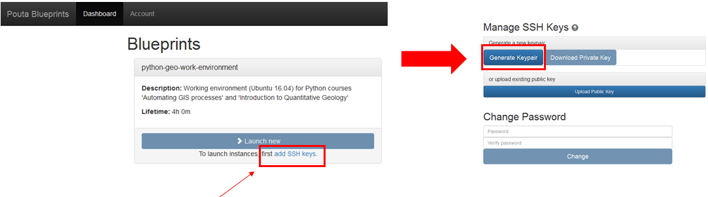

Activating Pebbles account
==========================

The first time using the course environment, it is necessary to activate
your Pebbles account and create your password. This needs to be
done only once when the course starts.

.. note::

    If you already have activated your account you can continue with `launching a new computer instance <intro-to-course-environment.html#launch-a-new-computer-instance>`__.

To activate your account, follow these steps:

1. **Follow the activation link that was sent to you by the course
   lecturer** (example):

2. **Create a password for your account** (Be sure to remember this, you
   will need it frequently)

.. figure:: img/3_create_password.PNG
   :alt: Create password

   Create password

3. **Log into the Pouta Blueprint dashboard**

.. figure:: img/4_log_in.PNG
   :alt: Log into PB

   Log into PB

4. **Create your SSH keys**

   Create SSH Keypair

You **don't** need to download the generated Keypair into your computer. Now you are ready to go with
`launching your first computer instance <intro-to-course-environment.html#launch-a-new-computer-instance>`__.
