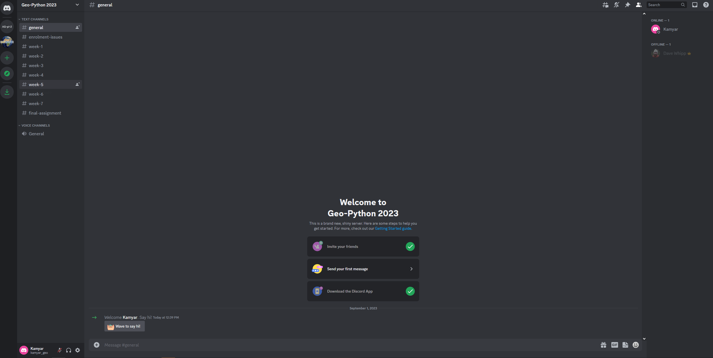
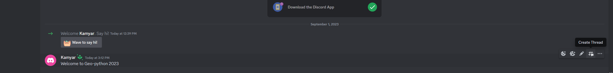

Communicating with Discord
========================

.. figure:: img/Discord-logo.png
   :width: 250px
   :class: dark-light

During this course we will use `Discord <http://discord.com>`__ for discussion and questions about the lessons and exercises.

Accessing the workspace in Discord
----------------------------------

We will send an invitation link for all enrolled students to the Discord Team called ``Geo-Python 2023``.
Before you can start using Discord, you should create a new account for Discord (if you don't have one already) and accept the invitation you have received.

**After accepting the invitation, you can access the course Discord team via this link:** `<https://discord.com/channels/1140629215608315964/1140629216082280470>`__

Overview of Discord
-----------------

Using Discord for communication is easy. It works in a similar manner to any chatting application (such as WhatsApp). However, the benefits of Discord are:

- discussions are grouped into separate topics (called ``channels``) that keeps discussions nicely organized
- it is easy to find stuff with good search functionality
- you can notify different users by using the ``@`` character (e.g. ``@user1``)
- you can start threads for specific question, for example, and add comments in that thread (keeps comments nicely grouped under the question)
- works nicely in browser and has applications for all major operating systems (Android, iOS, Windows, macOS, etc.)

Basic usage of Discord
----------------------

When entering to our Discord Team you should see something like following where you have:

- all channels listed on the left panel
- on the right you have the selected channel where you can start discussing about the topics for that week:

   Basic view of Discord

Notifying a user
~~~~~~~~~~~~~~~~

If you want to ask a question from specific user (or target a comment for him/her), it is possible to notify the user by using the ``@`` symbol.

The example below shows how to do this.

.. figure:: img/notifying-user.PNG
   :alt: You can notify a user
   :width: 550px

   You can target your question/answer to speficic user with the ``@`` character.

Using threads
~~~~~~~~~~~~~

You can further organize and group the discussion by starting a new thread for selected post.
Start a new thread by keeping your mouse over the post that you want to start discussing about and press the # icon to create a new thread.

   Organizing discussion with threads.

You can view the active thread by pressing the thread that has some replies.
The thread opens up as a new panel on the right side where you will see all the discussion that is relevant for the topic or question at hand.

General guidelines for communication
------------------------------------

Here we have few general guidelines for using Discord to keep things well organized.

.. important::

   1. **You should always select the right channel for your question!**

      - If you have question related to the lesson or exercise in week 2, ask your question in the ``#week-2`` channel.
      - If you want to share a funny GIF you found online, you can post it in the ``#random`` channel.

   2. Use threads to maintain the discussion of a specific topic under the same question / comment.

   3. **Ask!** If something seems to be tricky or difficult in the course, don't hesitate to ask a question. Your fellow students or the instructors can help you out.

   4. **Discuss and comment!** If you see a question and you know how to help, we encourage you to comment and help your fellow students.

   5. **HOWEVER, DON'T PROVIDE READY ANSWERS** in the discussion (such as all necessary codes for a given problem). This does not help your other students to learn.

With these guidelines we keep our discussion well organized and it is easy for everybody to find help and relevant discussion about specific lessons / exercises.

That's it! Now you know how to communicate during the course.
