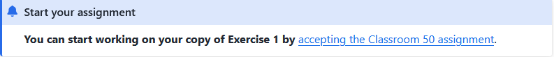
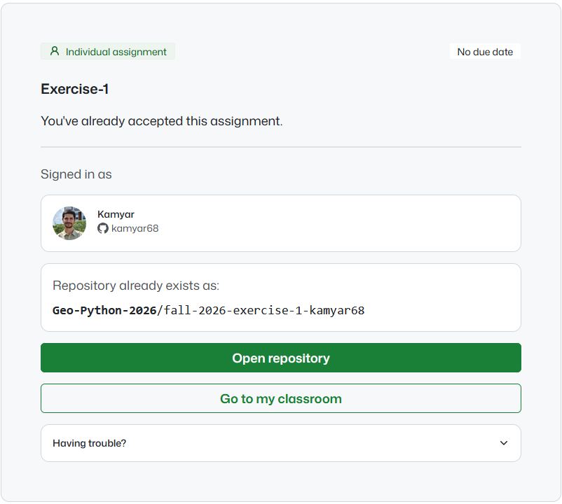

Using Classroom 50 for GitHub
==============================
As you have seen last week, we will be using `Classroom 50 <https://classroom50.org/>`__ for the exercises in the course.
Here, we'll give you a sense of how Classroom for GitHub works and what you need to do to accept your assignments.

Classroom 50
------------
Classroom 50 is basically an application that helps you make private copies of an assignment that you can modify and submit as your answers for the exercises.
We will create a template repository for each assignment, and Classroom 50 takes care of the student copies.

The exercise repositories normally include the following:

-  A basic description of the assignment
-  A list of problems for you to solve/answer
-  "Starter" Jupyter notebook or Python code that you need to modify for the assignment
-  Data files to use with the code

You can find the classroom link for each exercise on these web pages in
the **Start your assignment** info box on the exercise pages.

When you click the Classroom 50 link, you will be taken to a web page where you can accept the assignment.

.. note::
   In order to accept an assignment, you must be enrolled in the course organization. Follow your teacher's instructions on how to do this.

   Creating an exercise repository using Classroom 50

When you accept the assignment, a copy of it will be made in your personal GitHub repositories (a repository on GitHub is basically like a folder for a given assignment/project), and you will be asked to make changes to the Python code and main document for each assignment.