Meet Git
=========

This tutorial covers the very basics of version control using Git and GitHub.
These materials have been adapted for the geo-python course from `GitHubClassroom Campus Advisors -resources <https://github.com/Campus-Advisors>`_, and `Git documentation <https://git-scm.com/about/>`__.

After this lesson you should be able to do these steps in JupyterLab using git and the JupyterLab git-plugin:

1. `Clone a repository from GitHub`_
2. `Add changes`_
3. `Commit changes`_
4. `Push changes to GitHub`_

Key concepts
~~~~~~~~~~~~

We use Git to record changes to our files over time, and for communicating between the local repository on our computer and the remote repository on GitHub.
A "repository", or a "Git project", or a "repo", is a location for storing files. A repo contains all the files and folders associated with a project and the revision history of each entity.
In general, it is recommended that each project, library or discrete piece of software should have it's own repository.
In this course each exercise has it's own repository on GitHub.

During this course, we often start by cloning an existing repository from GitHub
to our own computer using ``git clone``. Using ``git pull`` we can fetch (and merge) new changes from GitHub,
and ``git push`` publishes our local changes to GitHub. Read more about sharing and updating
Git projects `in here <https://git-scm.com/book/en/v2/Appendix-C:-Git-Commands-Sharing-and-Updating-Projects>`__.

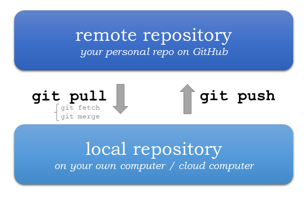

    Update your Git project using the pull and push commands. Always pull before you push (especially when working in a shared project)!

Version control history consists of snapshots of all the files in our project.
In order record changes to our files, we first add changes to a so called staging area (using ``git add``). The idea is, that you can have a (sometimes messy) working directory, and by using ``git add`` you tell
Git which files to include in the next committed snapshot. Finally, ``git commit`` records a permanent snapshot of the staged changes. Read more about basic snapshotting `in here <https://git-scm.com/book/en/v2/Appendix-C:-Git-Commands-Basic-Snapshotting>`__.

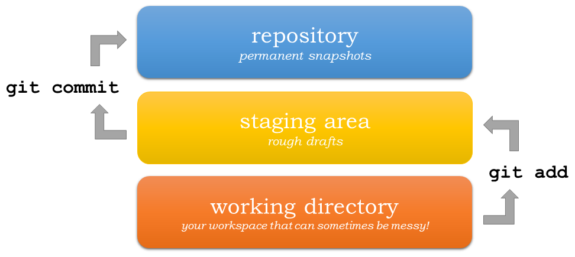

    Version control steps using Git (adapted from `Git documentation <https://git-scm.com/about/staging-area>`__).

Preparations
---------------------
Let's go through the basics of using Git. We will use Exercise-1 repository created last week for practicing.
Before we start, open a new JupyterLab session.

You can find instructions for using Binder and CSC Notebooks in :doc:`Lesson 1 materials <../../L1/course-environment-components>`.

.. image:: https://img.shields.io/badge/launch-binder-red.svg
   :target: https://mybinder.org/v2/gh/Geo-Python-2020/Binder/master?urlpath=lab

.. image:: https://img.shields.io/badge/launch-CSC%20notebook-blue.svg
   :target: https://notebooks.csc.fi/#/blueprint/7e62ac3bddf74483b7ac7333721630e2

Using the JupyterLab git plugin
-------------------------------

Before we continue, we need the URL of your exercise repository from GitHub. **Go to** https://github.com/geo-python-2020/ **and navigate to your personal Exercise-1 repository.**

On GitHub, find the button **Clone** and copy the url under *Clone with HTTPS*.

The URL looks something like this:
https://github.com/Geo-Python-2020/exercise-1-VuokkoH.git but with your own username or team name.

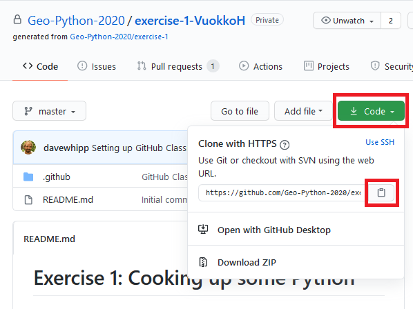

Clone a repository from GitHub
~~~~~~~~~~~~~~~~~~~~~~~~~~~~~~~

During this course, we will most often start working with the exercises using an existing repository from GitHub.
In order to get a copy of the exercise repository on our own computer (or the cloud computer), we need to `clone` it.

Navigate to the **exercises** folder in JupyterLab and activate the git-plugin. The plugin will tell you that **exercises**
is not a Git repository and gives you some options.

In our case, we want to **Clone a Repository**:

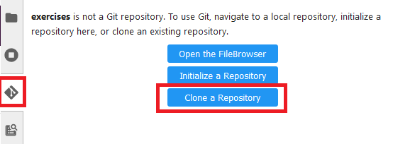

Go ahead and paste your exercise repository URL into the pop-up window:

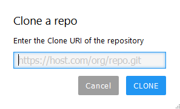

On the command line this action is equivalent to the ``git clone`` command.

.. note::

    **Pay attention to which folder you are in!** Git will create a new folder under the folder you
    are located in when cloning a repo.

Credentials
~~~~~~~~~~~~~~

Git needs to know who you are in order to give you access to remote repositories.

**Insert your GitHub username and password**:

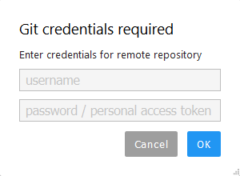

Now you should see a new folder in JupyterLab that is identical to the repository on GitHub.

On the command line, credentials can be managed using ``git config``.

Git status
~~~~~~~~~~~~~~

Navigate to the new folder in JupyterLab and activate the Git plugin. You should now see some basic info about your repository:

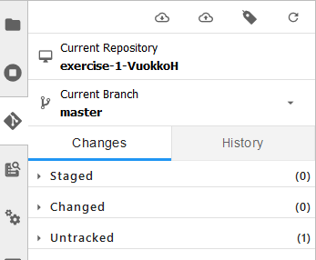

On the command line ``git status`` shows the status of the repository.

Add changes
~~~~~~~~~~~~~~

Let's start making changes in the repository! Open the ``README.md`` -file and make some edits. For example, add some text at the end of the file:

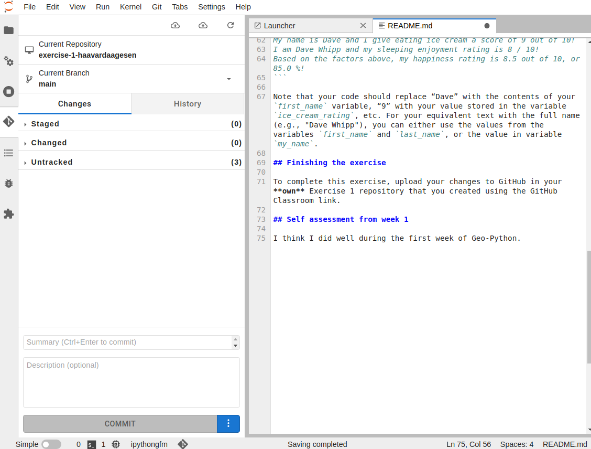

    Edit a file in JupyterLab

After saving your changes, check the status of the repository. You should see ``README.md`` listed under **Changed** files:

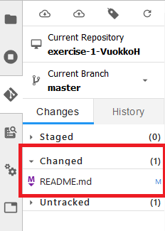

    Changes visible in the Git plugin

These changes are not yet "staged for commit", which means that we need to add them first to the staging area if we want to make a permanent snapshot of these changes.

.. figure:: img/git-plugin-stage-changes.png

After adding the changes, you should see the changed file under **Staged** in the Git plugin.

Note that you can also **unstage** and **discard changes** using the plugin.
For now, we are happy with the changes made, and are ready to commit them.

On the command line, ``git add``  is the command for adding changes to the staging area.

Commit changes
~~~~~~~~~~~~~~~~~

Once the changed files are in the staging area, we can create a permanent snapshot by committing the changes.
Always remember to write an informative commit message to accompany your changes:

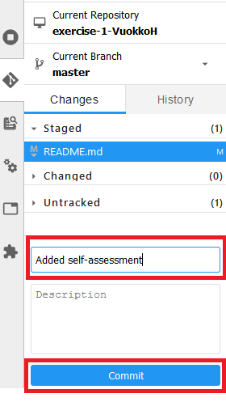

Once you hit the commit-button, the plugin will most likely ask your name and email.

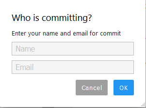

You can insert the same details you used when signing up to GitHub.

.. figure:: img/git-plugin-commit-ok.png

Once the commit succeeds, you should see the latest set of changes under the History-tab in the Git-plugin:

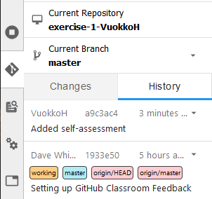

*Note: You might also see some previous changes by the course instructors. These changes have been generated automatically and you can ignore them.*

On the command line the syntax for committing is ``git commit -m "commit message"``. After committing, it is good practice to check the repository status using ``git status``.

.. note::

    We can **tell Git to remember our GitHub username and password** to avoid typing them in all the time. Open up a Terminal window and type in this command:

    ``git config --global credential.helper 'cache --timeout=3600'``

    The ``--timeout`` parameter specifies the time Git remembers our credentials in seconds.  See instructions for other operating systems than linux `here <https://help.github.com/en/articles/caching-your-github-password-in-git>`__.

Push changes to GitHub
~~~~~~~~~~~~~~~~~~~~~~
Next, we want to synchronize our local changes with the remote repository on GitHub.
First, it's good to use :code:`git pull` to double check for remote changes before contributing your own changes.

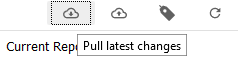

Unless you cached your credentials, Git will once more prompt you for username and password at this point.

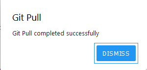

In this case, the repository is probably up-to-date and no new changes are downloaded. However, it is good practice to always use Git Pull before publishing your local changes in case someone made changes in the remote repository in the meanwhile!

Now we are ready to push the local changes to GitHub using :code:`git push`:

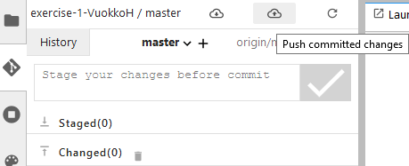

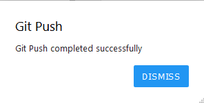

Now you should see the updates in GitHub! Go and have a look at your personal repository in https://github.com/Geo-Python-2020/ .

On the command line, ``git pull`` fetches and merges changes from the remote repository, and ``git pull`` publishes local changes.

That's all you need to know about Git for know :)

Using Git from the command line
-------------------------------

There are many different ways of using git, and you might want to try out using Git from the command line at some point.

.. note::
    You will need to know a couple of basic command line commands in order to use Git from the command line. Code Academy's `list of command line commands <https://www.codecademy.com/articles/command-line-commands>`__ provides
    a good overview of commonly used commands for navigating trough files on the command line. For using Git on the command line, you should at least be familiar with these commands:

    - ``ls`` - list contents of the current directory
    - ``ls -a`` - list contents of the current directory including hidden files
    - ``cd`` - change directory. For example, ``cd exercises``
    - ``cd ..`` - move one directory up

**Start a new Terminal session in JupyterLab** using the icon on the Launcher, or from *File* > *New* > *Terminal*.

.. figure:: img/terminal-icon.png

**Check if you have git installed** by typing :code:`git --version` in the terminal window:

.. code-block:: bash

    $ git --version

Anything above version 2 is just fine.

.. note::

    You can paste text on the terminal using :code:`Ctrl + V` or :code:`Shift + Right Click --> paste`

.. admonition:: Configuring Git credentials on the command line

    Configure Git to remember your identity using the ``git config`` tools. You (hopefully) only need to do this once
    if working on your own computer, or a cloud computer with persistent storage.

    ``git config --global user.name "[firstname lastname]"``

    ``git config --global user.email "[email@example.com]"``

The basic workflow of cloning a repository, adding changes to the staging area, committing and pushing the changes can be completed using these command line commands:

- ``git clone [url]`` - retrieve a repository from a remote location (often from GitHub)
- ``git status``- review the status of your repository (use this command often!)
- ``git add [file]`` - add files to the next commit (add files to the staging area)
- ``git commit -m "[descriptive message]"`` - commit staged files as a new snapshot
- ``git pull`` - bring the local branch up to date (fetch and merge changes from the remote)
- ``git push`` - transmit local branch commits to the remote repository

.. note::

    Check out other commonly used git commands from `the GIT CHEAT SHEET <https://education.github.com/git-cheat-sheet-education.pdf>`__

.. note::

    Remember to use ``git status`` often to check the status of our repository.

.. admonition:: Remote repository

    Remote repositories are versions of your project that are hosted on a network location (such as GitHub).
    When we cloned the repository using ``git clone``, Git automatically started tracking the remote repository from where we cloned the project.
    You can use the ``git remote -v`` command to double check which remote your repository is tracking.

    **A common mistake during this course is that you have accidentally cloned the template repository in stead of your own/your teams repository.**

    You can read more about managing remotes `in here <https://git-scm.com/book/en/v2/Git-Basics-Working-with-Remotes>`__.

What to do case of conflicts?
------------------------------

It is possible that you will encounter a **merge conflict** at some point of this course. A merge conflict might happen if two users have edited the same content, or if you
yourself have edited the same content both on GitHub and locally without properly synchronizing the changes. In short, Git will tell you if it is not able to sort out the version history of your project by announcing a merge conflict.

We won't cover how to solve merge conflicts in detail during the lessons. You can read more about `how to resolve merge conflicts from the Git documentation <https://git-scm.com/docs/git-merge#_how_to_resolve_conflicts>`__.
**The best thing to do to avoid merge conflicts is to always Pull before you Push new changes.**
In case you encounter a merge conflict, don't panic! Read carefully the message related to the merge conflict, and try searching for a solution online and ask for help on Slack.

Remember that you can always download your files on your own computer, and upload them manually to GitHub like we did in Exercise 1!

.. figure:: https://imgs.xkcd.com/comics/git.png
    :alt: https://xkcd.com/1597/

    Source: https://xkcd.com/1597/

