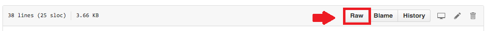
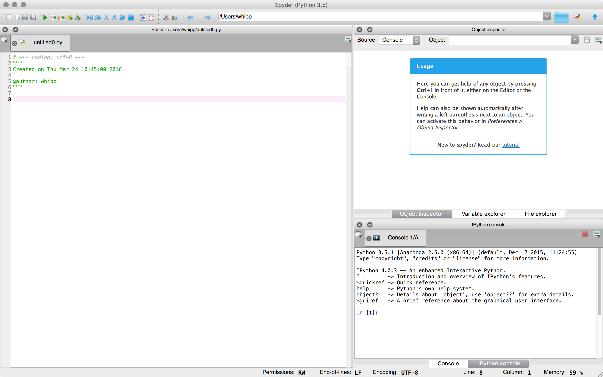
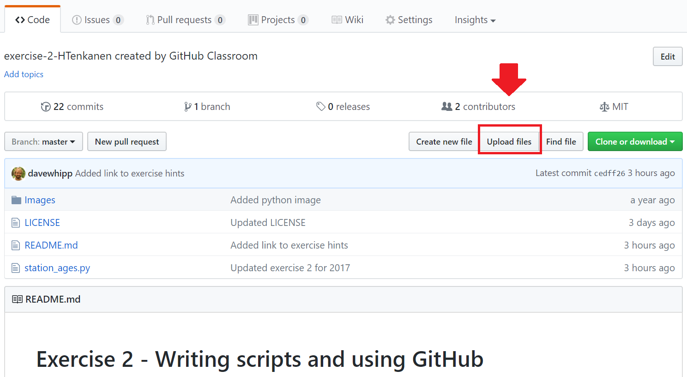
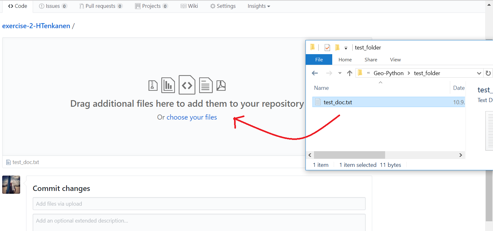
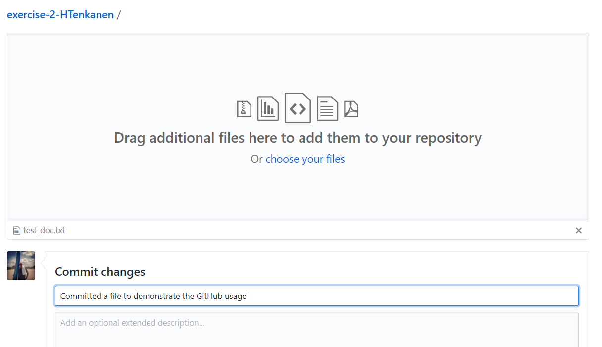
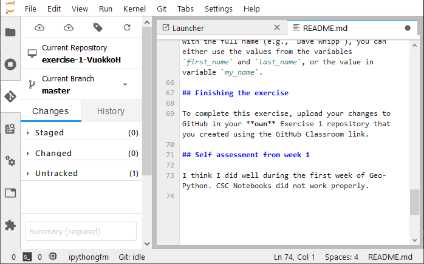
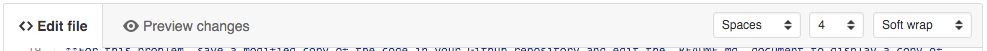

Working on the assignments
==========================

For most assignments you will be modifying the "starter" Python code
that will be provided as part of the files copied to the assignment
repository when you accept the assignment. After you get the code
working, you will have questions to answer by modifying the main
assignment document.

In the following parts we well introduce to you how to:

1. Download materials from GitHub
2. Save your work / changes to GitHub
3. Write your answers

Using GitHub to download materials and to save your work
--------------------------------------------------------

You should first download a copy to your computer where you plan to work
on the assignment. The Computer Instance that we use in the course has a
working installation of `Anaconda <Anaconda.md>`__. You can download a
copy of the code by first clicking on the filename that you want to download
and from the following page right-clicking a button called ``Raw`` and clicking
**Save Link As...** or the equivalent in your web browser.
This will allow you to download a copy of the Python code
to your computer with ``.py`` file extension.

   Download the file by rigth-clicking the ``Raw`` button and clicking ``Save Link As ..``

.. important::

   When you download the data to your computer make sure that the file extension is ``.py``. It seems that the
   browser wants to download the file with extension ``.txt`` by default. Hence, you need to replace the ``.txt`` extension
   with ``.py``

Modifying the "starter" code in Spyder
--------------------------------------

Here are some suggestions for working with the "starter" code.

-  **Open Spyder**. Since there is a working Anaconda installation on
   the computer instance, you will have the `Spyder
   program <https://pythonhosted.org/spyder/>`__. Spyder will make it
   easier to modify and test your Python code than using **gedit** and a
   separate IPython interpreter. In the computer instance, you can
   either launch **Spyder** by double clicking the Spyder icon on the
   desktop or typing in the terminal:

   .. code:: bash

       $ spyder

   It may take a minute or two to open. In Windows you should have an
   application you can launch from the Start Menu, and on a Mac you can
   open the Anaconda Launcher on your Desktop and find **Spyder** there.

|

-  **Open the "starter" code in Spyder**. Once you open Spyder you
   should see something like the window below.

   Spyder

You can open your code in Spyder by going to **File -> Open...** in the
menu bar. Select the code you downloaded and you're ready to start
editing. - **Make changes and test**. You can edit your Python code in
Spyder just like a normal editor and make whatever changes you would
like. After you have made some changes and would like to test them, save
your file using **File -> Save** in the menu bar. Now you can have
Spyder run your code by clicking on the green play button at the top of
the window or by pressing the F5 key. Your code will run and the results
(plots, printed text, errors, etc.) will be output to the IPython
console on the bottom right panel. If you need more space to see the
console, you can drag the margins on the console frame to make it
bigger.

Committing your work to GitHub
------------------------------

After you have made some change to the code that you want to save, you should upload it to your
assignment repository on GitHub.

You can do this by clicking on the **Upload files** button on the main page of the assignment repository
and selecting the file you have been editing on your computer.

   Upload files

Now you can drag and drop the file you want to upload to GitHub.

   Drag and drop the file(s) you want to upload

When you upload the file, be sure to include a nice short commit message
in the **Commit changes** box stating what you changed in the code since
the last time you uploaded. To save the changes you click the **Commit
changes** button.

   Include a short message describing what you did when you commit.

.. note::

   You are encouraged to upload your Python code **every time** you make a significant change, such as fixing one of
   the problems in the starter code.

.. important::

   Note that you **DON'T need to change the name of the file you are committing even if one would already exist in the repository.**
   One of the main advantage of version control is that you keep on working under the same file and commit it regularly to GitHub.
   In this way Git will be able to track the changes that you have made to the file and you can see the full history of
   that file if you want to.

Answering the questions
-----------------------

In your assignment repository you have a document titled ``README.md``
that contains the instructions for the assignment. This document is what
is displayed by default in GitHub when you view the main page of a
repository, and it is written in a simple language called
`Markdown <https://daringfireball.net/projects/markdown/>`__. Markdown
allows you to write text in a normal text editor or on a web page and
then have that text converted from plain text to a nicely formatted
document using simple formatting styles. We would like for you to enter
your answers to the questions in the assignment in the ``README.md``
document, as well as embedding any plot figures. To edit your
``README.md`` file, you can do the following:

1. **Open the** ``README.md`` **for editing**. Click on the ``README.md`` in
   the list of files in the assignment repository, and then click on the
   **pencil icon** in the toolbar above the ``README.md`` to edit the
   document. The toolbar should look like the image below.

   Editing toolbar

2. **Make your changes**. After you click on the **pencil icon** you
   will see the Markdown version of the assignment document, and this is
   what you should edit. At the bottom of the ``README.md`` you will
   find a section that starts with ``# Answers``. This is the section
   you should edit to add answers and plots for the assignment problems.
   Adding *italics* and **bold** text is easy, and if you would like
   more information on formatting you should take a look at the Github
   page on `Github-flavored
   Markdown <https://help.github.com/articles/basic-writing-and-formatting-syntax/>`__.

|

3. **Preview your changes**. After you have made your changes, it is a
   good idea to click on **Preview changes** to make sure the changes
   you have made are formatted the way you expect. Markdown is pretty
   easy to use, but sometimes things don't end up looking the way you
   might like. **Preview changes** is in the editing bar above the
   document text, as shown below.

   Preview changes

4. **Save your changes**. After you are done editing, you can save your
   changes by adding a commit message and clicking on the **Commit
   changes** button. As above, it is a good idea to make a short note of
   what you changed when you make changes in the **Commit changes** box.

|

5. **Check out the "pro" tips**. Below you will find some tips for using
   GitHub that will help you produce nicer looking plots and Markdown
   files, and to get the most out of using a resource like GitHub.

Pro tips
--------

Below is a short list of tips that might help you in preparing your
answers for the assignments.

-  **Save your stuff often**! You are strongly encouraged to commit
   (save) your changes regularly. For instance, each time you fix one of
   the issues in the "starter" Python code, you should upload a new copy
   and commit the changes with a short commit message. It might seem
   like extra work, but you can always go back to earlier versions of
   what you have saved on GitHub, so making frequent saves will ensure
   that you can find an older, working version of code in the event that
   you accidentally delete part of the code or otherwise break things.

-  **You can always go back**. One of the best things about using GitHub
   is that you are able to go back to previous versions of the documents
   you save. For instance, if you decide to remove a section from your
   Python code and later realize this was `a huge
   mistake <https://youtu.be/46Kv4rBJi68>`__, you will be able to go
   back to earlier versions of the Python code that have been saved in
   GitHub. To go back to an earlier version simply click on the
   **History button** for one of the files in your GitHub repository, as
   shown below.

   History button

Once you pull up the document history you can click on
the hash (the set of 7 numbers/letters listed to the right of a given
version) to see the changes made for that save, or click on the ``<>``
button to see the version of the file at that time in the past.

-  If you want to put you images into your answers document
   (``README.md``), I encourage you to upload copies of the images to
   the ``Images`` directory and then embed them using the Markdown
   format for images:

   ::

       

   You start with an ``!``, put some simple text (2-4 words) about the
   image between square brackets ``[]``, and then add a link to the
   image between parentheses ``()``. Check out the example for Exercise
   2 if this is unclear.

|

-  **Use good quality images**. By default, Spyder will display your
   images in the IPython console window, and the image quality is just
   OK. If you would like to make nicer images to include in your answers
   to the problems, you can run you Python code outside of Spyder by
   typing

   .. code:: bash

       ipython your-script.py

   If your code is working, this should result in your plot popping up
   in a separate window and when you save the plot it will be at a
   higher resolution than the equivalent in the IPython console in
   Spyder. It is always nice to produce the best looking plots you can!

