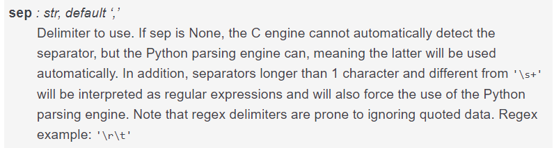

More advanced data processing with Pandas
=========================================

#fp = r"C:\HY-DATA\HENTENKA\KOODIT\Opetus\Geo-Python\admin\data-to-consider\Lesson-6\Helsinki-Vantaa-Jan-Sept-2017-hourly\6591337447542dat_August.txt"

Notice that this time, we will read the **actual** data obtained from NOAA
without any modifications to the actual data by us. The data looks like following:

Notice from above that our data is separated with varying amount of spaces (fixed width).

.. note::

    Write the codes of this lesson into a separate script called ``weather_analysis.py`` because we will re-use the codes we write here again later.

Import pandas and specify filepath to the file that we want to read.

.. ipython:: python

    import pandas as pd
    fp = r"C:\HY-DATA\HENTENKA\KOODIT\Opetus\Geo-Python\admin\data-to-consider\Lesson-6\Helsinki-Vantaa-Jan-Sept-2017-hourly\6591337447542dat_sample.txt"

As the data was separated with varying amount of spaces, we need to tell Pandas to read it like that
with ``sep`` parameter that says following things about it:

Hence, we can separate the columns by varying number spaces of spaces with ``sep='\s+'`` -parameter.
Our data also included No Data values with varying number of ``*`` -characters. Hence, we need to take also those
into account when reading the data. We can tell Pandas to consider those characters as NaNs by specifying ``na_values=['*', '**', '***', '****', '*****', '******']``.

.. ipython:: python

    data = pd.read_csv(fp, sep='\s+', na_values=['*', '**', '***', '****', '*****', '******'])

Let's see how the data looks by printing the first five rows with ``head()`` function

.. ipython:: python

    print(data.head())

Let's check what columns do we have.

.. ipython:: python

    print(data.columns)

Okey there are quite many columns and we are not interested to use all of them.
Let's select only columns that might be used to detect unexceptional weather conditions, i.e. 'YR--MODAHRMN', 'DIR', 'SPD', 'GUS','TEMP', 'MAX', 'MIN'

.. ipython:: python

    select_cols = ['YR--MODAHRMN', 'DIR', 'SPD', 'GUS','TEMP', 'MAX', 'MIN']
    data = data[select_cols]

Let's see what our data looks like now by printing **last** 5 rows and the datatypes.

.. ipython:: python

    print(data.tail())
    print(data.dtypes)

The column names that we have are somewhat ackward. Let's change them into more intuitive. This can be done easily with ``rename()`` -function.
We can define the new column names by using a specific data type in Python called `dictionary <https://www.tutorialspoint.com/python/python_dictionary.htm>`__ where we can determine the original column name (the one which will be replaced), and the new column name.
Let's change ``YR--MODAHRMN`` column into ``TIME``, ``SPD`` into ``SPEED``, and ``GUS`` into ``GUST``

.. ipython:: python

    name_conversion_dict = {'YR--MODAHRMN': 'TIME', 'SPD': 'SPEED', 'GUS': 'GUST'}

Now we can change the column names by passing that dictionary into parameter ``columns`` in ``rename()`` -function.

.. ipython:: python

    data = data.rename(columns=name_conversion_dict)
    print(data.columns)

Perfect, now our column names are more easy to understand and use.
Let's check some basic statistics to understand our data better.

.. ipython:: python

    print(data.describe())

Okey so from here we can see that there are varying number of observations per column. For example ``SPD`` and ``TEMP`` column has 72 observations
whereas ``GUS`` has only 20 observations and ``MAX`` and ``MIN`` has only 2 observations.
From here we can already guess that `MAX`` and ``MIN`` attributes are most probably not going to be useful for us .
However, ``GUS`` might be.

Let's explore further our data by checking the first 30 rows of it.

.. ipython:: python

    print(data.head(30))

Okey, so from here we can actually see that the ``GUST`` column contains information only on an hourly level. That might be useful! Let's keep this in mind.

Let's do the same thing as many times before and convert our Fahrenheit temperatures into Celsius.
In this time, however, we will use our self-made function to do the conversion.

Here I provide you the function that you can copy and paste into your own script.

.. ipython:: python
  :suppress:

    def fahrToCelsius(temp_fahrenheit):
        converted_temp = (temp_fahrenheit - 32) / 1.8
        return converted_temp

.. code:: python

    def fahrToCelsius(temp_fahrenheit):
        """
        Function to convert Fahrenheit temperature into Celsius.

        Parameters
        ----------

        temp_fahrenheit: int | float
            Input temperature in Fahrenheit (should be a number)
        """

        # Convert the Fahrenheit into Celsius and return it
        converted_temp = (temp_fahrenheit - 32) / 1.8
        return converted_temp

Let's do the conversion by iterating our data line by line and updating a column called ``CELSIUS`` that we will create.
We can iterate over the rows of Pandas DataFrame by using ``iterrows()`` -function.
When iterating over the rows in our ``DataFrame`` it is noteworthy to understand that the Pandas actually keeps track on the ``index`` value as well.
Hence, the contents of a single row actually contains not only the values, but also the ``index`` of that row.

|
Let's see how it works. Here, we will use a specific `Python command <https://www.tutorialspoint.com/python/python_break_statement.htm>`__ called ``break`` can be used to stop the iteration right after the first loop.
# This can be useful as we don't want to fill our console by printing all the values and indices in our DataFrame, but to just see if the function works as we want.

for idx, row in data.iterrows():
    print('Index:', idx)
    print(row)
    break

Okey, so here we can see that the ``idx`` variable indeed contains the index value and the ``row`` variable contains all the data from that given row stored as a pd.Series

|
Let's now create an empty column for the Celsius temperatures and update the values into that column by using our function. Here is the whole procedure:

.. ipython:: python
  :suppress:
  col_name = 'Celsius'
  data[col_name] = None
  for idx, row in data.iterrows():
    celsius = fahrToCelsius(row['TEMP'])
    data.loc[idx, col_name] = celsius

.. code:: python

  # Create an empty column for the data
  col_name = 'Celsius'
  data[col_name] = None

  # Iterate ove rows
  for idx, row in data.iterrows():
    # Convert the Fahrenheit temperature of the row into Celsius
    celsius = fahrToCelsius(row['TEMP'])
    # Add that value into 'Celsius' column using the index of the row
    data.loc[idx, col_name] = celsius

Let's see what we have now.

.. ipython:: python

  print(data.head())

Great! Now we have converted our temperatures into Celsius by using the function that we created ourselves.
Knowing how to use your own function in Pandas can be really useful when doing your own analyses.

Let's also convert the wind speeds into meters per second values (m/s) as they are more familiar to us in Finland. This can be done with a formula ``m/s = mph x 0.44704``

.. ipython:: python
  data['SPEED'] = data['SPEED']*0.44704
  data['GUST'] = data['GUST']*0.44704

Let's see the result by printing the first 30 rows.
print(data.head(30))

Okey it worked. When looking the data more carefully, we can see something interesting:
``GUST`` seems to be measured only once an hour, whereas ``SPD`` (wind speed), and our temperatures seem to be measured approximately every 20 minutes (at minutes XX:00, XX:20 and XX:50).

That might be a problem as we might not be able to compare e.g. the average wind speeds and the speeds during the gust together as they are measured with different intervals.
This kind of mismatch between sampling rates of measurements is actually quite typical when working with real data.

How we can solve this kind of problem is to aggregate the wind speeds into hourly level data as well so the attributes become comparable.
First we need to be able to group the values by hour. This can be done e.g. by slicing the date+hour time from the ``TIME`` column (i.e. removing the minutes from the end of the value)

Doing this requires two steps:
  1. Convert the ``TIME`` column from ``int`` into ``str`` datatype.
  2. Include only numbers up to hourly accuracy (exclude minutes) by slicing texts

.. note::

  There are also more advanced functions in Pandas to do time series manipulations by utilizing ``datetime`` datatype and ``resample()`` -function, but we won't cover those here. Read more information about creating `datetime index <http://pandas.pydata.org/pandas-docs/version/0.20/generated/pandas.to_datetime.html>`__ and aggregating data by time with resampling from `here <https://pandas.pydata.org/pandas-docs/stable/timeseries.html#resampling>`__ if you are interested.

Let's convert the time into string. And check that the data type changes.

.. ipython:: python

  data['TIME_str'] = data['TIME'].astype(str)
  print(data.head())
  print(data['TIME_str'].dtypes)
  print(type(data.loc[0, 'TIME_str']))

Okey it seems that now we indeed have the ``TIME`` as ``str`` datatype as well.
Now we can slice them into hourly level by including only 10 first characters from the text (i.e. excluding the minute-level information).

.. ipython:: python

  data['TIME_dh'] = data['TIME_str'].str.slice(start=0, stop=10)
  print(data.head())

Nice! Now we have information about time on an hourly basis incudling the date as well.

.. note::

  Notice that all the typical ``str`` functionalities can be applied to Series of text data with syntax ``data['mySeries'].str.<functionToUse>()``.

Let's also slice only the hour of the day (excluding information about the date) and convert it back to integer (we will be using this information later)

.. ipython:: python

  data['TIME_h'] = data['TIME_str'].str.slice(start=8, stop=10)
  data['TIME_h'] = data['TIME_h'].astype(int)
  print(data.head())

Wunderbar, now we have also a separate column for only the hour of the day.

Next we want to calculate the average temperatures, wind speeds, etc. on an hourly basis so that it could be
possible to compare all of them to each other.

This can be done by aggregating the data, i.e.:

  1. **grouping the data** based on hourly values
  2. Iterating over those groups and calculating the average values of our attributes
  3. Inserting those values into a new DataFrame where we store the aggregated data

Let's first create a new **empty** DataFrame where we will store our aggregated data
aggr_data = pd.DataFrame()

Let's then group our data based on ``TIME_h`` attribute that contains the information about the date + hour

.. ipython:: python

  grouped = data.groupby('TIME_dh')

Let's see what we have now.

.. ipython:: python

  print(type(grouped))
  print(len(grouped))

Okey, interesting. Now we have a new object with type ``DataFrameGroupBy``. And it seems that we have 23 individual groups in our data, i.e. one group for each hour of the day.
Let's see what we can do with this ``grouped`` -variable.

As you might have noticed earler, the first hour in hour data is ``2017080400`` (midnight at 4th of August in 2017).

Let's now see what we have on hour ``grouped`` variable e.g. on the first hour ``2017080400``.
We can get the values of that hour from ``DataFrameGroupBy`` -object with ``get_group()`` -function.

.. ipython:: python

  time1 = '2017080400'
  group1 = grouped.get_group(time1)
  print(group1)

Ahaa! As we can see, a single group contains a **DataFrame** with values only for that specific hour.
This is really useful, because now we can calculate the average values for all weather measurements (+ hour) that we have.

We can do that by using the ``mean()`` -function that we already used during the Lesson 5.

Let's calculate the mean for following attributes: ``DIR``, ``SPEED``, ``GUST``, ``TEMP``, and ``Celsius``.

.. ipython:: python

  mean_cols = ['DIR', 'SPEED', 'GUST', 'TEMP', 'Celsius', 'TIME_h']
  mean_values = group1[mean_cols].mean()
  print(mean_values)

Nice, now we have averaged our data. Notice that we still have information about the hour but not about the date which is at the moment stored in ``time1`` variable.
We can insert that datetime-information into our ``mean_values`` Series so that we have the date information also associated with our data.

.. ipython:: python

  mean_values['TIME_dh'] = time1
  print(mean_values)

Perfect! Now we have also time information there. The last thing to do is to add these mean values into our DataFrame that we created.
That can be done with ``append()`` -function in a quite similar manner as with Python lists.
In Pandas the data insertion is not done **inplace** (as when appending to Python lists) so we need to specify that we are updating the aggr_data (using the ``=`` sign)
We also need to specify that we ignore the index values of our original DataFrame (i.e. the indices of ``mean_values``).

.. ipython:: python

  aggr_data = aggr_data.append(mean_values, ignore_index=True)
  print(aggr_data)

Now we have a single row in our new DataFrame where we have aggregated the data based on hourly mean values.
Next we could continue doing and insert the average values from other hours in a similar manner but, of course, that is not
something that we want to do manually (would require repeating these same steps too many times).
Luckily, we can actually iterate over all the groups that we have in our data and do these steps using a for loop.

When iterating over the groups in our ``DataFrameGroupBy`` object
it is noteworthy to understand that a single group in our ``DataFrameGroupBy`` actually contains not only the actual values, but also information about the ``key`` that was used to do the grouping.
Hence, when iterating over the data we need to assign the ``key`` and the values into separate variables.

Let's see how we can iterate over the groups and print the key and the data from a single group (again using ``break`` to only see what is happening).

.. ipython:: python

  for key, group in grouped:
      print(key)
      print(group)
      break

Okey so from here we can see that the ``key`` contains the value ``2017080400`` that is the same
as the values in ``TIME_dh`` column. Meaning that we, indeed, grouped the values based on that column.

Let's see how we can create a DataFrame where we calculate the mean values for all those weather attributes that we were interested in.
I will repeate slightly the earlier steps so that you can see and better understand what is happening.

.. ipython:: python
  :suppress:

  aggr_data = pd.DataFrame()
  mean_cols = ['DIR', 'SPEED', 'GUST', 'TEMP', 'Celsius', 'TIME_h']
  for key, group in grouped:
      mean_values = group[mean_cols].mean()
      mean_values['TIME_dh'] = key
      aggr_data = aggr_data.append(mean_values, ignore_index=True)
  print(aggr_data)

.. code:: python

  # Create an empty DataFrame for the aggregated values
  aggr_data = pd.DataFrame()

  # The columns that we want to aggregate
  mean_cols = ['DIR', 'SPEED', 'GUST', 'TEMP', 'Celsius', 'TIME_h']

  # Iterate over the groups
  for key, group in grouped:
      # Aggregate the data
      mean_values = group[mean_cols].mean()

      # Add the ´key´ (i.e. the date+time information) into the aggregated values
      mean_values['TIME_dh'] = key

      # Append the aggregated values into the DataFrame
      aggr_data = aggr_data.append(mean_values, ignore_index=True)

  # Print the data
  print(aggr_data)

Great! Now we have aggregated our data based on daily averages and we have a new DataFrame where that data is stored.

Finally, we are ready to see and find out if there are any outliers in our data suggesting to have a storm (meaning strong winds in this case).
We define an outlier if the wind speed is 2 times the standard deviation higher than the average wind speed (column ``SPEED``).

# Let's first find out what is the standard deviation and the mean of the Wind speed.

.. ipython:: python

  std_wind = aggr_data['SPEED'].std()
  avg_wind = aggr_data['SPEED'].mean()
  print('Std:', std_wind)
  print('Mean:', avg_wind)

Okey, so the variance in the windspeed tend to be approximately 2.1 m per second, and the wind speed is approximately 4.2 m per second.
Hence, the threshold for a wind speed to be an outlier with our criteria is:

.. ipython:: python

  upper_threshold = avg_wind + (std_wind*2)
  print('Upper threshold for outlier:', upper_threshold)

Let's finally create a column called ``Outlier`` which we update with ``True`` value if the windspeed is an outlier and ``False`` if it is not.
We do this again by iterating over the rows.

.. code:: python

  # Create an empty column for outlier info
  aggr_data['Outlier'] = None

  # Iterate over rows
  for idx, row in aggr_data.iterrows():
      # Update the 'Outlier' column with True if the wind speed is higher than our threshold value
      if row['SPEED'] > upper_cutoff :
          aggr_data.loc[idx, 'Outlier'] = True
      else:
          aggr_data.loc[idx, 'Outlier'] = False
  print(aggr_data)

.. ipython:: python

  aggr_data['Outlier'] = None
  for idx, row in aggr_data.iterrows():
      if row['SPEED'] > upper_cutoff :
          aggr_data.loc[idx, 'Outlier'] = True
      else:
          aggr_data.loc[idx, 'Outlier'] = False
  print(aggr_data)

Okey now we have at least many False values in our ``Outlier`` -column.
Let's select the rows with potential storm and see if we have any potential storms in our data.

.. ipython:: python

  storm = aggr_data.ix[aggr_data['Outlier'] == True]
  print(storm)

Okey, so it seems that there was one outlier in our data but the wind during that time wasn't that strong as the average speed was only 9 m/s.
This is not too strange as we were only looking at data from a single day.

Let's continue by executing the script that we have written this far and use it to explore outlier winds based on whole month of August 2017.
For this purpose you should change the input file to be ``6591337447542dat_August.txt``

.. note::

  Notice that if you haven't written your codes into a script, you can take advantage of the history tab where the history of all your codes should be written from this session (you can copy / paste from there).

# Let's run
sys.exit()

# Okey, interesting! Now we can see the the days and hours when it has been stormy in August 2017.
# It seems that the storms have usually been during the day time. Let's check if this is the case.
# We can easily count how many stormy observations for different hour of the day there has been by
# using a ``value_counts()`` -function that calculates how many observations per certain value there are
# in a certain column (works best for categorigal data).

# Let's see the counts for different hours of the day
print(storm['TIME_h'].value_counts())

# Okey, this is interesting. It seems that most often it has been stormy at 14:00 GMT (i.e. 16:00 at Finnish time).
# Notice, that there haven't been any strong winds during the night, which is also interesting. However, as the **The weather guys** explains us, `it is not that surprising actually <http://wxguys.ssec.wisc.edu/2013/11/18/why-does-the-wind-diminish-after-sunset/>`__ =).

# The average wind speed may not be the perfect measure to find extreme weather conditions. Gust might usually be better a better measure for that.
# Let's see what were the strongest gust winds in our dataset by sorting the values.
gust_sort = storm.sort_values(by='GUST', ascending=False)
print(gust_sort)

# Interesting there was one hour with quite extraordinary gust wind in our data happening at 12th of August in 2017.
# Indeed, that was a big storm in Helsinki called `Kiira <https://yle.fi/uutiset/osasto/news/saturday_night_storm_downs_trees_cuts_electricity_in_the_south/9773250>`__ that caused major damage in different parts of the city.

# Task: Convert the ``TIME_h`` values into Finnish timezone which is two hours ahead from GMT.

# Hint: Using iterrows() -function is not the most efficient way of using your self-made functions. In Pandas, there is a function called ``apply()``
# that takes advantage of the power of numpy when looping, and is hence much faster which can give a lot of speed benefit when you have millions of rows to iterate over.
# Below I show how to do the similar thing by using our own function with ``apply()``.
# I will make a copy of our original DataFrame so this does not affect our original data.
# Before using this approach, we need to modify our function a bit to get things working.
# First, we need to have a parameter called ``row`` that is used to pass the data from row into our function
# (this is something specific to ``apply()``  -function in Pandas) and then add paramaters for passing the information about the column name that contains the temperatures in Fahrenheit,
# and the column name where the coverted temperatures will be updated (i.e. the Celsius temperatures).
# Hence, in the end, you can see that this is a bit more generic function to use (i.e. the columns to use in the calculation are not "hard-coded").

def fahrToCelsius(row, src_col, target_col):
    """
    A generic function to convert Fahrenheit temperature into Celsius.

    Parameters
    ----------

    row: pd.Series
        Input row containing the data for specific index in the DataFrame

    src_col : str
        Name of the source column for the calculation. I.e. the name of the column where Fahrenheits are stored.

    target_col : str
        Name of the target column where Celsius will be stored.
    """
    # Convert the Fahrenheit into Celsius and update the target column value
    row[target_col] = (row[src_col]- 32) / 1.8
    return row

# Take a copy
data2 = data.copy()

# Apply our new function and update the values into a new column called ``Celsius2``
data2 = data2.apply(fahrToCelsius, src_col='TEMP', target_col='Celsius2', axis=1)

# As you can see here, we use the ``apply()`` function and as the first parameter
# we pass the name of the function that we want to use with the ``apply()``, and then we pass the names of the source column and the target column.
# Lastly, it is important to add as a last parameter ``axis=1`` that tells for the function to apply the calculations vertically (row by row) instead of horizontally (would move from column to another).

# See the results
data2.head()

# Indeed it seems that our function worked because the values in ``Celsius`` and ``Celsius2`` columns are the same.
# With this approach it is extremely easy to reuse our function and pass the results into another new colum e.g.
data2 = data2.apply(fahrToCelsius, src_col='TEMP', target_col='Celsius3', axis=1)
print(data2.head())

# Now we just added another column called ``Celsius3`` just by changing the value of the ``target_col`` -parameter.
# This is a good and efficient approach to use in many cases, and hence highly recommended (although it is a bit harder to understand).
