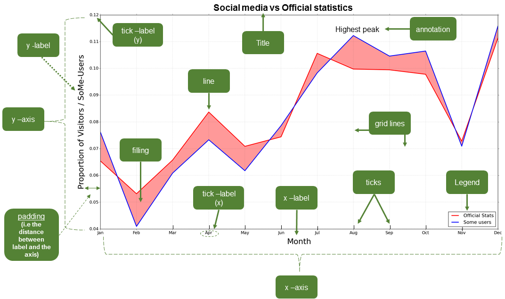

Anatomy of a plot
=================

Before starting to visualize our data on a plot our data we need to address an obvious question: What are the actual components of a plot?
We will not go deep into the details of different types of plots (as it is not the purpose of this lesson), but rather we provide a brief introduction to different plots that can be created using Python and the (essential) elements of a plot.

There are a variety of different kinds of plots (also known as graphs, charts, diagrams, etc.) available that have been designed to visually represent the characteristics of a dataset.
Here is a list of several different types of plots that can be used to present different kinds of data.

- `Bar chart <https://en.wikipedia.org/wiki/Bar_chart>`__
- `Histogram <https://en.wikipedia.org/wiki/Histogram>`__
- `Scatter plot <https://en.wikipedia.org/wiki/Scatter_plot>`__
- `Line chart <https://en.wikipedia.org/wiki/Line_chart>`__
- `Pie chart <https://en.wikipedia.org/wiki/Pie_chart>`__
- `Box plot <https://en.wikipedia.org/wiki/Box_plot>`__
- `Violin plot <https://en.wikipedia.org/wiki/Violin_plot>`__
- `Dendrogram <https://en.wikipedia.org/wiki/Dendrogram>`__
- `Chord diagram <https://en.wikipedia.org/wiki/Chord_diagram_(information_visualization)>`__
- `Treemap <https://en.wikipedia.org/wiki/Treemap>`__
- `Network chart <https://en.wikipedia.org/wiki/Network_chart>`__

In spite of the large variety of types of plots, there are certain elements that are common for most of them (not all).
Thus, it is useful to know at least the basic terminology since it makes it easier to find help and information from the internet when you start creating or modifying your own plots.

The figure below illustrates different elements of a basic line plot.

   Basic elements of a plot.

Common plotting terms
---------------------

These common terms may vary a bit depending on the plotting library that you use.
For the list provided here we are using the typical terms for plotting in Matplotlib (see also the figure above).

+---------------+-----------------------------------------------------------------------------------------------------------------------------+
| Term          | Description                                                                                                                 |
+===============+=============================================================================================================================+
| *axis*        | Axes of the graph that are typically x, y, and z (for 3D plots).                                                            |
+---------------+-----------------------------------------------------------------------------------------------------------------------------+
| *title*       | Title of the plot.                                                                                                          |
+---------------+-----------------------------------------------------------------------------------------------------------------------------+
| *label*       | Name for the axis (e.g. xlabel or ylabel).                                                                                  |
+---------------+-----------------------------------------------------------------------------------------------------------------------------+
| *legend*      | Legend for the plot.                                                                                                        |
+---------------+-----------------------------------------------------------------------------------------------------------------------------+
| *tick label*  | Text or values that are represented on the axis.                                                                            |
+---------------+-----------------------------------------------------------------------------------------------------------------------------+
| *symbol*      | Symbol for data point(s) (on a scatter plot) that can be presented with different symbol shapes/colors.                     |
+---------------+-----------------------------------------------------------------------------------------------------------------------------+
| *size*        | Size of, for example, a point on a scatter plot. Also used for referring to the text sizes on a plot.                       |
+---------------+-----------------------------------------------------------------------------------------------------------------------------+
| *linestyle*   | The style how the line should be drawn. Can be solid or dashed, for example.                                                |
+---------------+-----------------------------------------------------------------------------------------------------------------------------+
| *linewidth*   | The width of a line on a plot.                                                                                              |
+---------------+-----------------------------------------------------------------------------------------------------------------------------+
| *alpha*       | Transparency level of a filled element in a plot (values between 0.0 (fully transparent) and 1.0 (no transparency)).        |
+---------------+-----------------------------------------------------------------------------------------------------------------------------+
| *tick(s)*     | Refers to the tick marks on a plot.                                                                                         |
+---------------+-----------------------------------------------------------------------------------------------------------------------------+
| *annotation*  | Refers to the text added to a plot.                                                                                         |
+---------------+-----------------------------------------------------------------------------------------------------------------------------+
| *padding*     | The distance between an (axis/tick) label and the axis.                                                                     |
+---------------+-----------------------------------------------------------------------------------------------------------------------------+